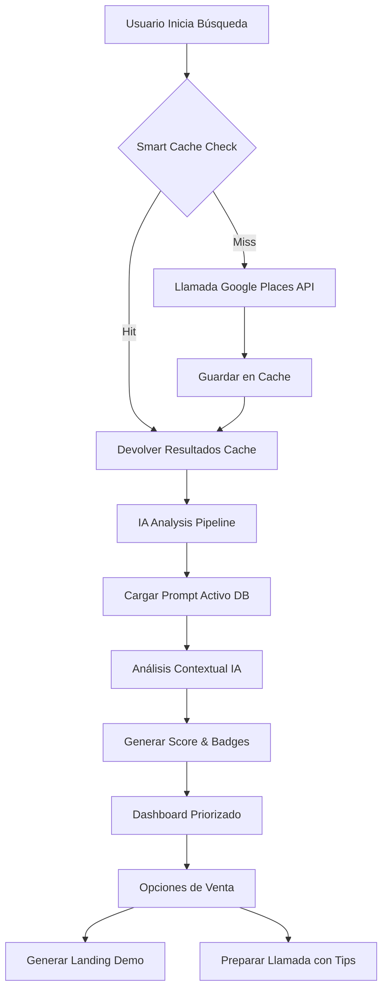

# NoahPro Deep Intelligence - Reporte de Desarrollo

## 1. Visión General
NoahPro Deep Intelligence es el cerebro avanzado del módulo Lead Hunter. Su objetivo es transformar datos brutos de Google Maps en inteligencia comercial accionable, priorizando los prospectos con mayor potencial de conversión y ofreciendo herramientas de automatización de ventas.

---

## 2. Funcionalidades Implementadas

### A. Scout con Datos Reales (Tarea 1)
- **Eliminación de Hardcoding**: El sistema ya no usa un valor fijo de 500€ para el ticket medio.
- **Configuración Dinámica**: El valor se lee de la tabla `hunter_user_settings`. Si no existe configuración, usa 500€ como fallback.
- **Preview de Smart Cache**: La interfaz muestra cuántos prospectos son nuevos y cuántos ya existen en la base de datos antes de iniciar la búsqueda masiva.

### B. Cerebro Abierto - Configurabilidad Total (Tarea 2)
- **Editor de Prompts**: Se ha integrado un editor en `Configuración > Cerebro IA` que permite modificar las instrucciones del sistema en tiempo real.
- **Versionado e Historial**: Cada vez que se guarda un prompt, se registra una versión previa en el historial para permitir reversiones.
- **Activación Selectiva**: Solo un prompt por categoría (ej: "hunter") puede estar activo a la vez.

### C. Scoring Multi-Servicio y Categorización (Tarea 3)
- **Detección Automática**: La IA analiza reseñas y contenido web para detectar necesidades de:
  - **TPV/Datáfonos**: Busca menciones a "solo efectivo" o problemas con pagos.
  - **Diseño Web**: Identifica negocios sin web o con sitios obsoletos.
  - **Marketing/Social**: Detecta falta de Instagram/Facebook o pocas reseñas.
  - **Kit Digital / Verifactu**: Categoriza negocios que deben cumplir con las nuevas normativas de facturación.
- **Cálculo de Score (0-100)**: Puntuación ponderada basada en la urgencia y tipo de oportunidad detectada.
- **Ordenación Inteligente**: El dashboard ordena automáticamente los prospectos por puntuación de oportunidad (de mayor a menor).

### D. Infraestructura RAG y Embeddings (Tarea 4)
- **Preparación Vectorial**: Añadida columna `embedding` para búsquedas semánticas.
- **Análisis de Competencia**: Infraestructura para comparar prospectos con negocios similares en la zona.
- **Base de Conocimiento**: Tabla `prospect_knowledge_base` para almacenar resúmenes inteligentes de cada análisis.

### E. Módulo de Llamadas y Voz (Tarea 5)
- **Call Logs**: Tabla preparada para almacenar grabaciones, transcripciones y análisis de sentimiento.
- **Tips de Venta**: Repositorio de consejos comerciales que se activan según la situación detectada por la IA durante la llamada.

### F. Smart Cache y Gestión de Costes (Tarea 6)
- **Reducción de Costes API**: Se ha implementado un sistema de caché con TTL de 30 días para búsquedas en Google Places.
- **Tracking de Consumo**: Nueva tabla para monitorizar el gasto estimado por cada llamada a la API de Google o IA.

---

## 3. Esquema Visual de Flujos

---

## 4. Estado Actual de las Funcionalidades

| Funcionalidad | Estado | Comentario |
| :--- | :--- | :--- |
| **Buscador Real-Time** | ✅ Completado | Integrado con Google Maps y Pusher. |
| **Cerebro Editable** | ✅ Completado | Funcional en Configuración > Cerebro IA. |
| **Scoring Multi-Servicio** | ✅ Completado | Detección de TPV, Web, Redes, etc. |
| **Smart Cache** | ✅ Completado | Ahorro real de costes implementado. |
| **RAG (Embeddings)** | 🟡 Infraestructura | Tablas creadas, lógica de vectores pendiente. |
| **Call Center AI** | ⚪ Skeleton | Estructura de base de datos y rutas lista. |

---

## 5. Próximos Pasos (Roadmap Desarrollo)

1. **Implementación de Vectores (RAG)**: Integrar un servicio de embeddings (ej: OpenAI o Gemini) para llenar la columna `embedding` y habilitar el análisis de competencia real.
2. **Refinamiento de Deduplicación Geográfica**: Mejorar la lógica que evita comprar el mismo prospecto si ya fue analizado por otro usuario del equipo.
3. **Módulo de Voz en Tiempo Real**: Desarrollar el frontend para la "Guía de Llamada" que use los `call_tips_templates`.
4. **Dashboard de Métricas IA**: Visualización del ROI y ahorro generado por el sistema de Smart Cache.

---
*NoahPro Deep Intelligence - Base Sólida para el Futuro Comercial*
